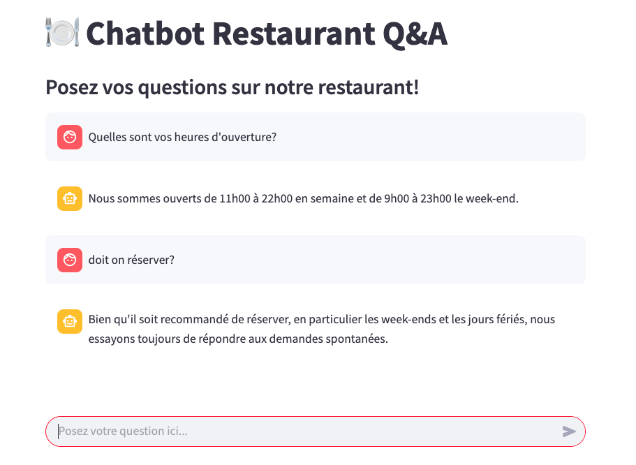

# 🍽️ Chatbot Restaurant Q&A

Un chatbot intelligent basé sur l'approche RAG (Retrieval-Augmented Generation), conçu pour répondre automatiquement aux questions fréquentes concernant un restaurant. Il extrait les réponses directement depuis un fichier PDF structuré contenant les questions/réponses officielles.



---

## 🚀 Technologies utilisées

- **LLM** : Mistral (via [Ollama](https://ollama.com/))
- **Embeddings** : Nomic Embed Text (via Ollama)
- **Vector Store** : Pinecone
- **Framework RAG** : LangChain
- **Interface utilisateur** : Streamlit

---

## ⚙️ Prérequis

- Python 3.8 ou supérieur
- [Ollama](https://ollama.com/) installé localement avec les modèles suivants :
  - `mistral`
  - `nomic-embed-text`
- Un compte [Pinecone](https://www.pinecone.io/) avec une clé API valide

---

## 🛠️ Installation

1. **Cloner le dépôt** :

```bash
git clone https://github.com/MamadouKane/restaurant-QA-Chatbot.git
cd restaurant-QA-Chatbot
```

2. **Installer les dépendances** :

```bash
pip install -r requirements.txt
```

3. **Configurer les variables d’environnement** :

Créez un fichier `.env` à partir de `.env.example` :

```bash
cp .env.example .env
```

Remplissez-le avec vos informations Pinecone :

```
PINECONE_API_KEY=your_pinecone_api_key
PINECONE_ENVIRONMENT=your_environment
PINECONE_INDEX_NAME=restaurant-qa
```

---

## 📄 Préparation des données

### 1. Créer l’index Pinecone

Avant toute ingestion, vous devez créer l’index dans Pinecone :

```bash
python app/create_index.py
```

> ⚠️ Ce script supprimera l’index existant s’il est déjà présent puis la recrée.

### 2. Ingérer les données Q&R du PDF

Placez votre fichier PDF dans le dossier `data/` puis lancez :

```bash
python app/ingest.py
```

Le script :

- lit tous les fichiers PDF dans `data/`
- extrait chaque question-réponse avec la section associée
- génère les embeddings
- stocke le tout dans Pinecone

---

## 💬 Lancer le chatbot

Démarrez l’interface utilisateur via Streamlit :

```bash
streamlit run app/app.py
```

L'application sera disponible sur : [http://localhost:8501](http://localhost:8501)

---

## ✨ Fonctionnalités

- ✅ Interface intuitive pour poser vos questions
- ✅ Moteur RAG avec récupération contextuelle des réponses
- ✅ Réponses générées à partir du contenu PDF du restaurant
- ✅ Mémoire de conversation (historique limité)
- ✅ Réponses affichées en streaming pour plus de fluidité

---

## ⚙️ Comportement technique

- 🔎 Le retriever retourne les 2 documents les plus pertinents (`k=2`)
- 🧠 Le modèle LLM utilisé est `mistral` (rapide et efficace)
- 🧠 La mémoire de conversation est limitée à quelques échanges pour rester pertinent
- 🧠 Les embeddings sont générés avec `nomic-embed-text`

---

## 🗂️ Structure du projet

```
restaurant-QA-Chatbot/
├── app/
│   ├── app.py           # Interface Streamlit principale
│   ├── ingest.py        # Script d'ingestion des PDF dans Pinecone
│   ├── create_index.py  # Création de l'index Pinecone
├── data/                # Contient vos fichiers PDF à ingérer
├── test.ipynb           # Notebook de test (Colab-friendly)
├── .env                 # Fichier de configuration local
├── .env.example         # Template pour .env
├── requirements.txt     # Dépendances Python
└── README.md            # Ce fichier
```

---

## 🧪 Tester sur Colab (optionnel)

Un notebook `test.ipynb` est fourni pour faire des tests rapidement, y compris l'ingestion de fichiers et l'interrogation simple sans interface.

---

Built with ❤️ by [Mamadou KANE](https://www.linkedin.com/in/kanemamadou/)
